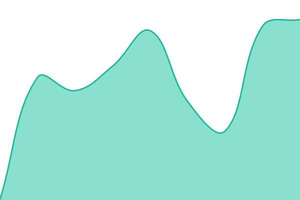

# [📈 Live Status](https://status.mikuuu.xyz): <!--live status--> **🟩 All systems operational**

This repository contains the open-source uptime monitor and status page for [hs.ypp](https://status.mikuuu.xyz), powered by [Upptime](https://github.com/upptime/upptime).

With [Upptime](https://upptime.js.org), you can get your own unlimited and free uptime monitor and status page, powered entirely by a GitHub repository. We use [Issues](https://github.com/cfm-miku-en/delta-status/issues) as incident reports, [Actions](https://github.com/cfm-miku-en/delta-status/actions) as uptime monitors, and [Pages](https://status.mikuuu.xyz) for the status page.

<!--start: status pages-->
<!-- This summary is generated by Upptime (https://github.com/upptime/upptime) -->
<!-- Do not edit this manually, your changes will be overwritten -->
<!-- prettier-ignore -->
| URL | Status | History | Response Time | Uptime |
| --- | ------ | ------- | ------------- | ------ |
|  [Website and API](https://delta.mikuuu.xyz/api/v2/changelog) | 🟩 Up | [website-and-api.yml](https://github.com/cfm-miku-en/uptime/commits/HEAD/history/website-and-api.yml) | 

 360ms
     
 | 

<a href="https://status.mikuuu.xyz/history/website-and-api">100.00%</a>
    

|  [Multiplayer](https://delta.mikuuu.xyz/signalr/multiplayer/negotiate) | 🟩 Up | [multiplayer.yml](https://github.com/cfm-miku-en/uptime/commits/HEAD/history/multiplayer.yml) | 

 174ms
     
 | 

<a href="https://status.mikuuu.xyz/history/multiplayer">100.00%</a>
    

|  [Spectator](https://delta.mikuuu.xyz/signalr/spectator/negotiate) | 🟩 Up | [spectator.yml](https://github.com/cfm-miku-en/uptime/commits/HEAD/history/spectator.yml) | 

 108ms
     
 | 

<a href="https://status.mikuuu.xyz/history/spectator">100.00%</a>
    

|  [Beatmap downloads (catboy.best)](https://catboy.best/api/v2/s/1) | 🟩 Up | [beatmap-downloads-catboy-best.yml](https://github.com/cfm-miku-en/uptime/commits/HEAD/history/beatmap-downloads-catboy-best.yml) | 

 264ms
     
 | 

<a href="https://status.mikuuu.xyz/history/beatmap-downloads-catboy-best">100.00%</a>
    

|  [Beatmap downloads (osu.direct)](https://osu.direct/api/v2/s/1) | 🟩 Up | [beatmap-downloads-osu-direct.yml](https://github.com/cfm-miku-en/uptime/commits/HEAD/history/beatmap-downloads-osu-direct.yml) | 

 651ms
     
 | 

<a href="https://status.mikuuu.xyz/history/beatmap-downloads-osu-direct">100.00%</a>
    

<!--end: status pages-->

[**Visit our status website →**](https://status.mikuuu.xyz)

## 📄 License

- Powered by: [Upptime](https://github.com/upptime/upptime)
- Code: [MIT](./LICENSE) © [Anand Chowdhary](https://anandchowdhary.com)
- Data in the `./history` directory: [Open Database License](https://opendatacommons.org/licenses/odbl/1-0/)
